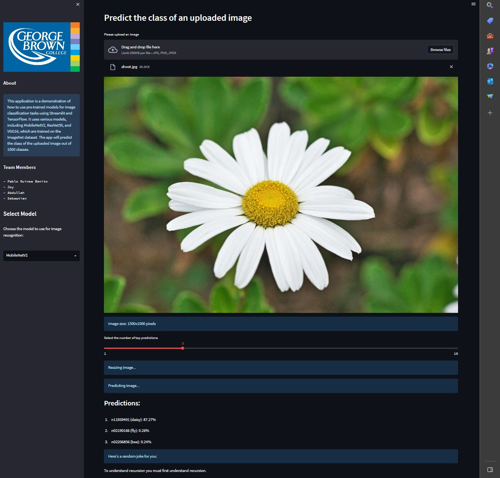
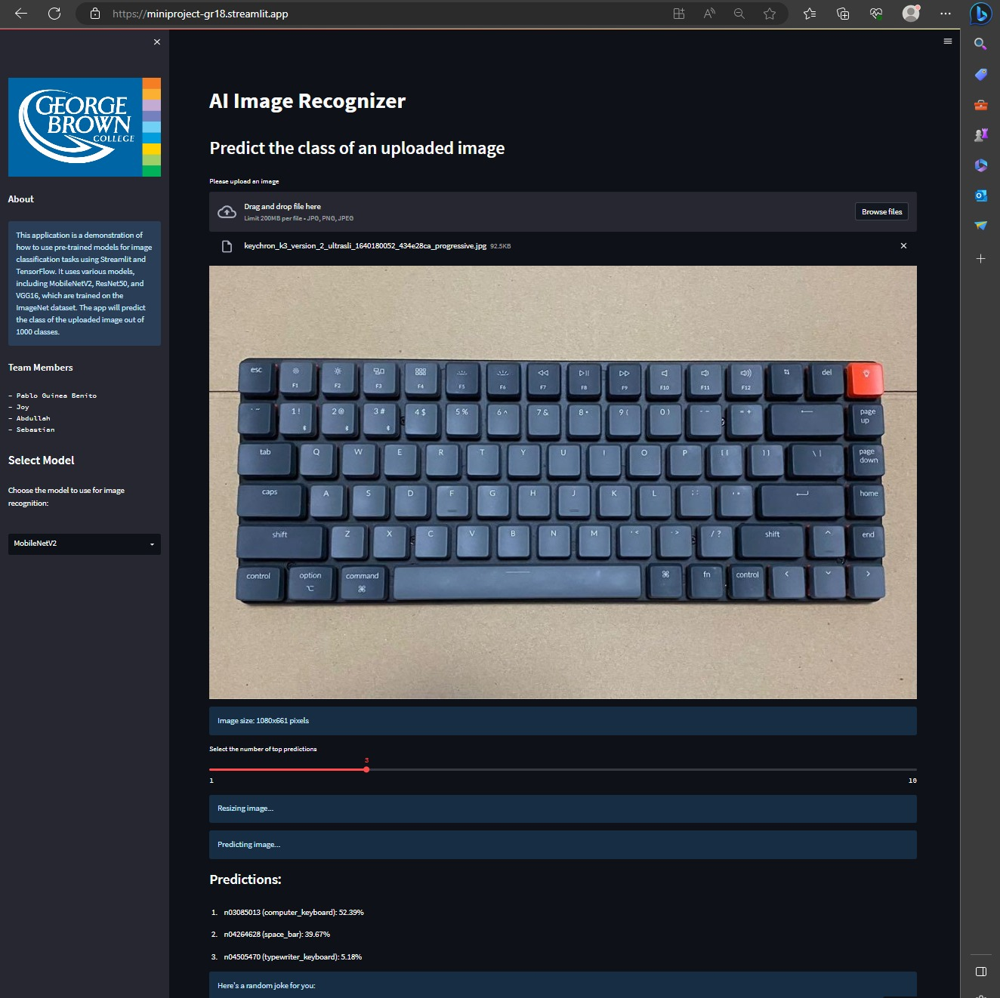
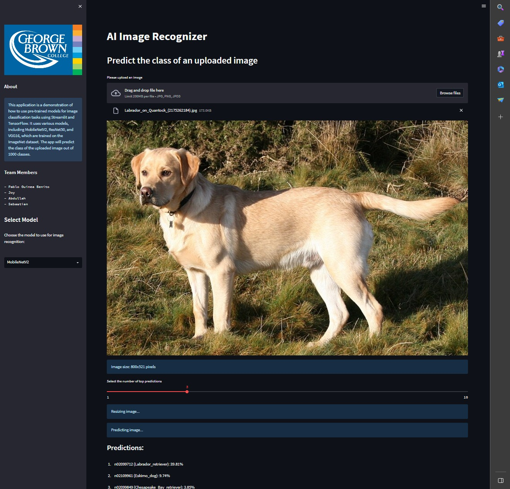

# AI Image Recognizer

The AI Image Recognizer is a Streamlit application that allows users to upload images and classify them into different categories using pre-trained deep learning models. The app provides three options for models: MobileNetV2, ResNet50, and VGG16.

## Models

### MobileNetV2
MobileNetV2 is a lightweight deep learning model designed for mobile and embedded vision applications. It achieves high accuracy while having a smaller model size and faster inference speed compared to larger models. MobileNetV2 is trained on the ImageNet dataset, which consists of millions of labeled images spanning 1000 classes. This model is a popular choice for various image classification tasks.

### ResNet50
ResNet50 is a deep residual network that contains 50 layers. It is known for its ability to train very deep neural networks effectively. ResNet50 has achieved state-of-the-art performance on various image classification benchmarks. Like MobileNetV2, ResNet50 is also trained on the ImageNet dataset. This model is often used for tasks that require more complex feature extraction and classification.

### VGG16
VGG16 is a deep convolutional neural network developed by the Visual Geometry Group at the University of Oxford. It consists of 16 layers and is known for its simplicity and effectiveness in image classification tasks. VGG16 has also been trained on the ImageNet dataset and has achieved excellent performance. This model is commonly used as a baseline for comparison in image classification research.

## How to run the app

1. Clone this repository to your local machine.
2. Install the dependencies by running the following command:
    - pip install -r requirements.txt
3. Run the app using Streamlit by executing the following command:
    - streamlit run app.py 

This will start the application and open it in your browser.

## How to use the app

1. Once the app is running, you will see a sidebar on the left-hand side. The sidebar contains information about the application and the team members involved.
2. In the sidebar, you will also find a selectbox labeled "Select Model". Use this selectbox to choose the deep learning model you want to use for image classification.
3. After selecting the model, you can proceed to upload an image. Click on the "Browse" button and select an image file (JPG, PNG, or JPEG format) from your local machine.
4. Once the image is uploaded, it will be displayed in the main area of the application.
5. The app will process the image using the selected model and provide predictions for the image's class. The top predictions will be displayed along with their corresponding probabilities.
6. You can use the slider labeled "Select the number of top predictions" to adjust the number of predictions you want to see.
7. After the predictions are displayed, a random joke will be shown for a fun touch.
8. If you upload another image, the process will repeat with the newly uploaded image.

## Screenshot

Interact with the app: [AI Image Recognizer](https://miniproject18part2.streamlit.app/)

